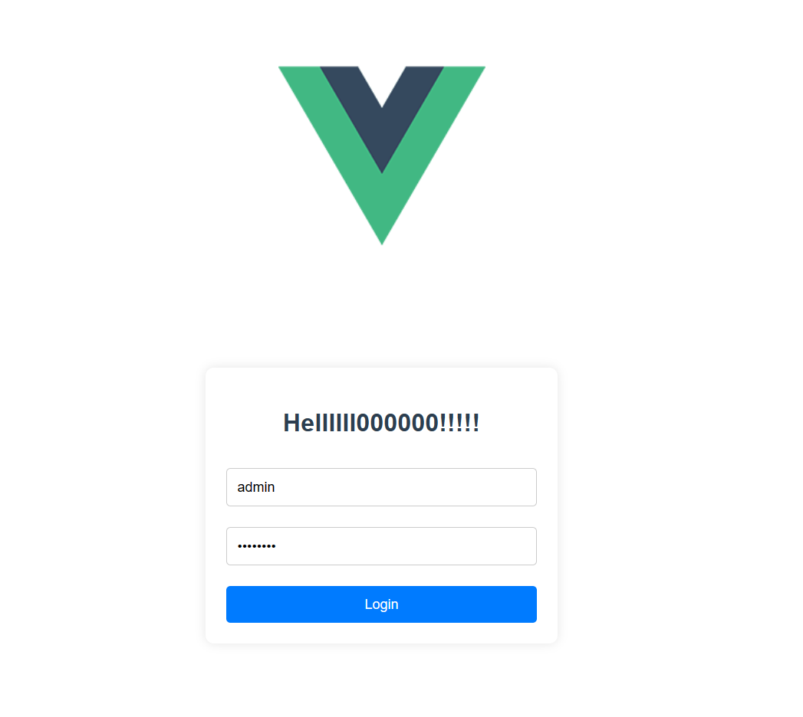

# hellometa

## Project setup
```
npm install
```

### Compiles and hot-reloads for development
```
npm run serve
```

### Compiles and minifies for production
```
npm run build
```

### Lints and fixes files
```
npm run lint
```

### Customize configuration
See [Configuration Reference](https://cli.vuejs.org/config/).

vue2，vue_cli 5.0.8  
* 当前更改：在js关闭组件驼峰命名法，创建简易登录界面
* 由于vue是单页面应用，采用router进行路由跳转，跳转时添加token，在路由配置中添加路由守卫可验证登录状态
* 当前内容为git仓库测试，此后的版本更新都在此仓库进行，后端使用git时可另外开设远程仓库

